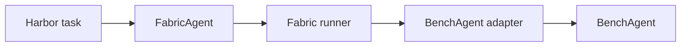

<!--
SPDX-FileCopyrightText: Copyright (c) 2026, NVIDIA CORPORATION & AFFILIATES. All rights reserved.
SPDX-License-Identifier: Apache-2.0
-->

# Run NVIDIA-labs Object Oriented Agents (NOOA) BenchAgent with Harbor

This walkthrough evaluates NOOA `BenchAgent` through NVIDIA NeMo Fabric's
complete Harbor path:



Harbor owns the task container, verification, reward, retries, and job layout.
The BenchAgent adapter owns model construction, one task execution, normalized
results, optional Relay telemetry, and cleanup.

## Prepare the task image

Complete the [shared Harbor setup](../README.md#shared-host-setup), clone OO
Agents beside this repository, and set a valid NVIDIA API key:

```bash
export NVIDIA_API_KEY="..."
test -d ../labs-OO-Agents/.git
```

Build source-consistent Fabric wheels, including a manylinux runtime wheel, and
stage committed Fabric and NOOA source into the ignored Docker build
context:

```bash
./examples/harbor/nooa_bench/prepare.sh ../labs-OO-Agents
```

The task image installs `nemo-relay>=0.7.2,<0.8`, NOOA core, `nooa-cli`,
`nooa-bench`, and the BenchAgent adapter. `prepare.sh` builds every Fabric wheel
in a fresh temporary directory and uses Maturin with Zig for manylinux 2.17
compatibility, so the Python 3.12 Debian task image does not depend on the
host's glibc version.

## Run the baseline

Run from the repository root:

```bash
uv run --extra harbor harbor run \
  --path examples/harbor/nooa_bench/task \
  --agent nemo_fabric.integrations.harbor:FabricAgent \
  --model nvidia/nemotron-3-nano-omni-30b-a3b-reasoning \
  --ak fabric_adapter_id=nvidia.fabric.nooa.bench-agent \
  --ak fabric_config_bundle=examples/harbor/nooa_bench/.bundle \
  --ak fabric_workspace=/app \
  --ak fabric_model_base_url=https://integrate.api.nvidia.com/v1 \
  --ak fabric_runtime_timeout_seconds=780 \
  --ae "NVIDIA_API_KEY=$NVIDIA_API_KEY" \
  --job-name nooa-bench-baseline \
  --jobs-dir examples/harbor/nooa_bench/runs \
  --n-concurrent 1 \
  --n-attempts 1 \
  --force-build
```

Validate the completed trial, normalized result, and reward:

```bash
uv run python examples/harbor/nooa_bench/verify_run.py \
  examples/harbor/nooa_bench/runs/nooa-bench-baseline
```

## Run with Relay telemetry

Repeat the same run with Relay enabled:

```bash
uv run --extra harbor harbor run \
  --path examples/harbor/nooa_bench/task \
  --agent nemo_fabric.integrations.harbor:FabricAgent \
  --model nvidia/nemotron-3-nano-omni-30b-a3b-reasoning \
  --ak fabric_adapter_id=nvidia.fabric.nooa.bench-agent \
  --ak fabric_config_bundle=examples/harbor/nooa_bench/.bundle \
  --ak fabric_workspace=/app \
  --ak fabric_model_base_url=https://integrate.api.nvidia.com/v1 \
  --ak fabric_runtime_timeout_seconds=780 \
  --ak fabric_telemetry=relay \
  --ae "NVIDIA_API_KEY=$NVIDIA_API_KEY" \
  --job-name nooa-bench-relay \
  --jobs-dir examples/harbor/nooa_bench/runs \
  --n-concurrent 1 \
  --n-attempts 1 \
  --force-build
```

Validate the reward plus the ATOF, promoted ATIF, nested LLM/tool scopes, and
single root invocation:

```bash
uv run python examples/harbor/nooa_bench/verify_run.py \
  examples/harbor/nooa_bench/runs/nooa-bench-relay \
  --require-relay
```

Harbor masks the value in its persisted config, but `--ae` supplies it to the
container process. Treat host process inspection and retained debug output as
sensitive while a credentialed run is active.
