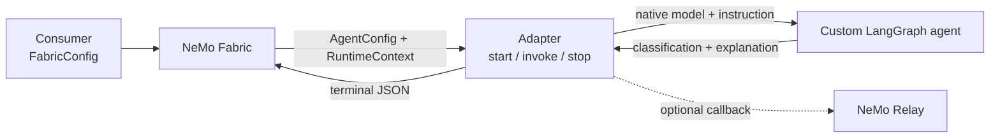

<!--
SPDX-FileCopyrightText: Copyright (c) 2026, NVIDIA CORPORATION & AFFILIATES. All rights reserved.
SPDX-License-Identifier: Apache-2.0
-->

# NVIDIA NeMo Fabric LangGraph Custom Agent Adapter

This source-only example implements an email-phishing analyzer as a custom
LangGraph agent with its own NeMo Fabric adapter. It is intentionally small:
the graph owns application behavior, the adapter owns translation and
lifecycle, and the consumer owns `FabricConfig`.

The classifier is illustrative, not a production security control.



## Read the Boundaries

| Source | Responsibility |
| --- | --- |
| [`consumer/config.py`](consumer/config.py) | Builds northbound configs and independent variations. |
| [`adapter/fabric-adapter.json`](adapter/fabric-adapter.json) | Declares the exact supported contract surface. |
| [`adapter/configuration.py`](adapter/configuration.py) | Maps typed `AgentConfig` into a native chat model and instruction. |
| [`adapter/runtime.py`](adapter/runtime.py) | Implements one `start`, zero or more `invoke`, and one `stop`. |
| [`adapter/telemetry.py`](adapter/telemetry.py) | Lazily activates optional Relay telemetry for an invocation. |
| [`agent/graph.py`](agent/graph.py) | Defines application behavior without importing Fabric or Relay. |

This is a dedicated custom-agent adapter: selecting its `adapter_id` selects
this email analyzer. It is not a generic loader for arbitrary LangGraph agents
and therefore does not accept `workflow`.

## Minimum Contract

The descriptor selects typed southbound configuration and advertises only the
fields the adapter applies:

```json
"config": {
  "input": "agent_config",
  "accepts": [
    "models",
    "models.base_url",
    "models.temperature",
    "instructions.system"
  ]
}
```

Fabric projects those values from `FabricConfig` into `AgentConfig`. The
adapter resolves `models.default` into `ChatOpenAI`, applies the normalized
system instruction, compiles one graph during `start`, and retains it for
ordered invocations. The custom graph receives native dependencies; it does
not parse either Fabric configuration type.

The current local-host binding still carries the invocation request and result
in JSON envelopes. That unavoidable extraction stays at the edge of
`adapter/runtime.py`; the preview `AgentRunRequest` and `AgentRunResult` types
are not emitted as negotiated transport structures.

A successful terminal output is deliberately small:

```json
{
  "classification": "phishing",
  "response": "The email combines several phishing signals.",
  "signals": ["urgency", "credential_request", "external_link"]
}
```

## Configuration Variations

Every variation returns an independent `FabricConfig`:

| Variation | Consumer API or CLI | Southbound effect |
| --- | --- | --- |
| Model | `public_config(model=...)` or `--model` | `models.default.model` |
| Endpoint | `public_config()` / `frontier_config()` | Credential-variable name and `models.default.base_url` |
| Instruction | `with_system_instruction(...)` or `--system-instruction` | `instructions.system` |
| Temperature | `with_temperature(...)` or `--temperature` | `models.default.temperature` |

For example:

```python
config = public_config()
config = with_system_instruction(config, "Explain only the strongest signal.")
config = with_temperature(config, 0.2)
```

The descriptor bounds variation. Unsupported providers, extra model roles,
model-specific settings, missing endpoints, and missing credential variables
fail explicitly rather than being ignored.

## Optional Relay Telemetry

`with_relay(config)` enables ATOF and ATIF without changing the adapter
lifecycle. During `invoke`, Fabric supplies `RuntimeContext.telemetry`; the
adapter loads that generated configuration, opens one invocation-level Agent
scope, and passes the public `NemoRelayCallbackHandler` through LangGraph
runnable config. Relay records the graph and its model-backed node, while the
terminal result remains separate.

Relay is imported only on the enabled path. This adapter does not implement a
streaming operation: Fabric's Relay-backed `Runtime.invoke_stream()` still
runs the ordinary adapter `invoke` operation.

## Run the Source Example

Until this example becomes a package, stage its descriptor under a development
adapter directory and make the repository importable:

```bash
uv sync --group adapter-tests
export FABRIC_LANGGRAPH_EXAMPLE="$PWD/.tmp/langgraph-custom-agent"
mkdir -p "$FABRIC_LANGGRAPH_EXAMPLE/adapters/langgraph-email-phishing"
cp examples/langgraph_custom_agent/adapter/fabric-adapter.json \
  "$FABRIC_LANGGRAPH_EXAMPLE/adapters/langgraph-email-phishing/"
export PYTHONPATH="$PWD"
export ADAPTER_PYTHON="$PWD/.venv/bin/python"
```

Planning is credential-free:

```bash
.venv/bin/python -m examples.langgraph_custom_agent.consumer \
  --variant public --base-dir "$FABRIC_LANGGRAPH_EXAMPLE" --plan
```

Run the requested default model through the public NVIDIA endpoint:

```bash
export NVIDIA_API_KEY="..."
.venv/bin/python -m examples.langgraph_custom_agent.consumer \
  --variant public --base-dir "$FABRIC_LANGGRAPH_EXAMPLE"
```

Use an internal OpenAI-compatible NVIDIA endpoint with the same config shape:

```bash
export NVIDIA_FRONTIER_API_KEY="..."
export NVIDIA_FRONTIER_BASE_URL="https://your-frontier-endpoint/v1"
.venv/bin/python -m examples.langgraph_custom_agent.consumer \
  --variant frontier --base-dir "$FABRIC_LANGGRAPH_EXAMPLE"
```

The endpoint key must grant access to the configured model. Use `--model` when
the endpoint exposes a different authorized model ID.

Add `--relay` to either live command to produce correlated ATOF and ATIF under
`$FABRIC_LANGGRAPH_EXAMPLE/artifacts/relay/`.

## Validate

```bash
.venv/bin/pytest tests/examples/langgraph_custom_agent -q
```

The focused tests cover descriptor projection, application behavior,
configuration mapping and rejection, repeated lifecycle invocation, cleanup,
configuration independence, Relay-off optionality, and correlated Relay
artifacts.

The example intentionally omits generic workflow loading, tools, MCP, skills,
checkpointing, cancellation, resume, updates, and native streaming. Adding a
dormant hook for any of those would make the minimum adapter harder to read.
