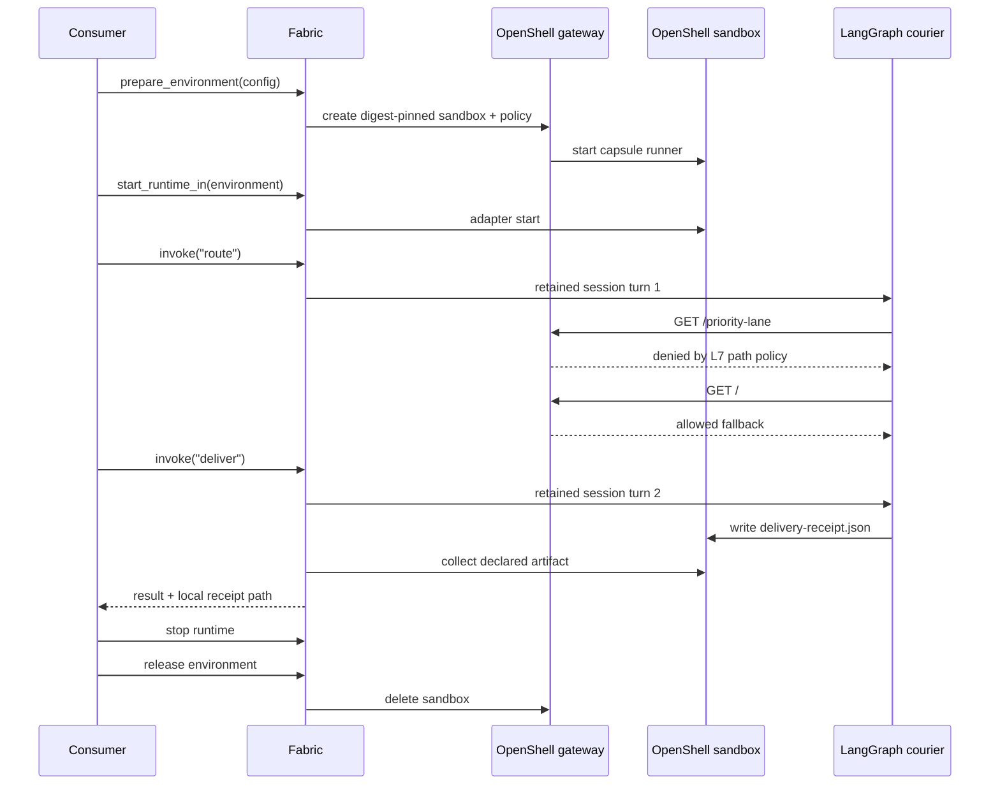

<!--
SPDX-FileCopyrightText: Copyright (c) 2026, NVIDIA CORPORATION & AFFILIATES. All rights reserved.
SPDX-License-Identifier: Apache-2.0
-->

# LangGraph in an OpenShell Fabric Capsule

Portable Courier is the smallest complete OpenShell strategic-value POC for
NVIDIA NeMo Fabric. It is credential-free and exercises a real, non-local
environment instead of mocking the boundary.

One Fabric runtime owns one stateful LangGraph session inside one OpenShell
sandbox. On turn one, the graph tries `GET /priority-lane`; the OpenShell L7
policy permits only `GET /`, so the graph observes the denial and reaches the
allowed fallback route. On turn two, the retained graph state is used to write
`delivery-receipt.json` below the capsule artifact root. Fabric then collects
that declared file through a typed, traversal-safe, size-bounded provider
operation and returns a local artifact reference to the consumer.



## Run the vertical slice

The runner builds the capsule, installs the local Fabric Python extension,
builds the OpenShell provider, starts a source-built Docker gateway on port
`18080`, executes both turns, collects the receipt, and releases the sandbox:

```bash
bash examples/langgraph_openshell_poc/run-demo.sh
```

The runner requires Docker, Rust/Cargo, CMake, `rustup`, and `uv`. Its first
source build can take several minutes because the OpenShell gateway is built
with its portable bundled-Z3 feature.

Set `OPENSHELL_ROOT` when the repositories are not siblings, or
`OPENSHELL_POC_PORT` when port `18080` is unavailable. The gateway log is kept
at `.tmp/openshell-poc/gateway.log`; the collected receipt is kept below
`.tmp/portable-courier/artifacts/`.

The script uses Fabric's environment lifecycle because that is convenient for
development and makes the POC self-contained. It is not a deployment
requirement. A production consumer can own OpenShell provisioning and pass a
prepared environment handle to the same Fabric runtime path.

## What this proves

- An existing Fabric Python-adapter contract can run unchanged inside an
  OpenShell capsule.
- A Fabric runtime remains a single-session, ordered invocation boundary; the
  consumer remains responsible for concurrency.
- Fabric can express the environment, ownership, connection, workspace,
  artifact roots, capsule image, and creation policy in one configuration.
- OpenShell, not Fabric, enforces filesystem, process, and L7 network policy.
- Adapter artifacts cross the sandbox boundary only when declared, and only
  through the bounded collection operation.
